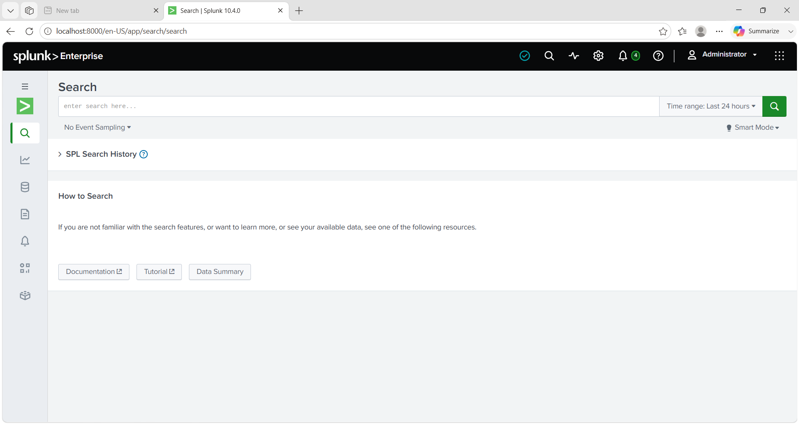

# Home SOC Lab



A hands-on Security Operations Center (SOC) home lab built to gain practical experience with Windows log collection, endpoint monitoring, and security event analysis using Splunk.

## Project Overview

The objective of this project was to build a basic SOC environment capable of collecting Windows endpoint logs and performing security investigations using Splunk Processing Language (SPL).

The lab demonstrates the complete workflow from configuring log collection to searching and analyzing endpoint events generated by normal Windows activity.

## Technologies Used

* Splunk Enterprise
* Splunk Universal Forwarder
* Microsoft Sysmon
* Windows 11
* SPL (Splunk Processing Language)

## Lab Components

* Splunk Enterprise installation and configuration
* Universal Forwarder configuration
* Sysmon deployment
* Windows Event Log collection
* Sysmon log ingestion
* SPL-based log analysis
* Endpoint activity investigation

## Skills Demonstrated

* Splunk administration
* Windows event log collection
* Sysmon configuration
* Endpoint monitoring
* SPL query development
* Process monitoring
* Network connection analysis
* PowerShell activity analysis
* Parent-child process investigation
* Windows log analysis

## Repository Structure

```text
Home-SOC-Lab/
│
├── README.md
├── learning-notes.md
│
├── setup/
│   ├── 01-splunk-enterprise-installation.md
│   ├── 02-universal-forwarder-installation.md
│   ├── 03-sysmon-installation.md
│   └── 04-log-ingestion.md
│
├── splunk/
│   ├── 01-spl-queries.md
│   └── 02-analysis-examples.md
│
└── screenshots/
    ├── setup/
    └── splunk/
```

## Project Workflow

1. Installed Splunk Enterprise
2. Configured the Splunk Universal Forwarder
3. Installed and configured Sysmon
4. Collected Windows Event Logs
5. Ingested Sysmon events into Splunk
6. Queried logs using SPL
7. Performed endpoint activity analysis

## Sample Analysis Performed

* Process creation monitoring
* PowerShell execution analysis
* Network connection monitoring
* Parent-child process analysis
* DNS activity review

## Screenshots

The repository includes screenshots demonstrating:

* Splunk installation
* Universal Forwarder configuration
* Sysmon deployment
* Successful log ingestion
* SPL queries
* Endpoint activity analysis

## Learning Outcome

This project provided practical experience in configuring a basic SOC environment, collecting endpoint telemetry, writing SPL queries, and analyzing Windows events using Splunk.

## Disclaimer

This project was created for educational and learning purposes in a controlled lab environment.
