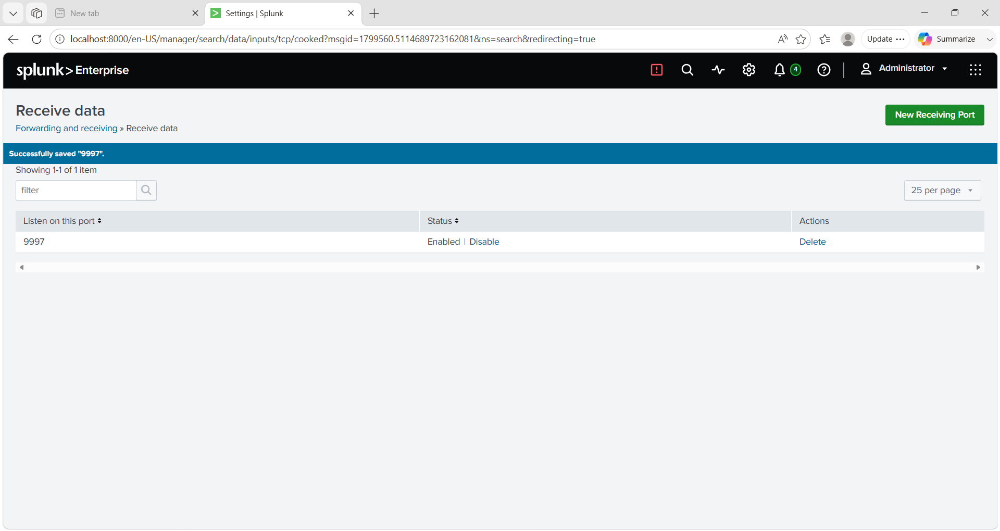
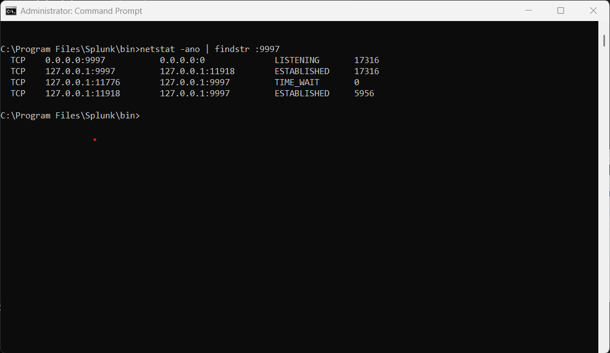

# Universal Forwarder Configuration

## Objective

Configure the Splunk Universal Forwarder to forward Windows Event Logs to Splunk Enterprise.

## Configuration

- Installed Splunk Universal Forwarder
- Configured forwarding destination to `127.0.0.1:9997`
- Enabled Windows Event Log collection
- Enabled Sysmon event collection

## Verification

- Configured Splunk receiving port (9997)
- Verified active connection between Universal Forwarder and Splunk Enterprise

## Screenshots

### Receiving Port

### Universal Forwarder Connection

## Outcome

Windows Event Logs are successfully forwarded from the Universal Forwarder to Splunk Enterprise.