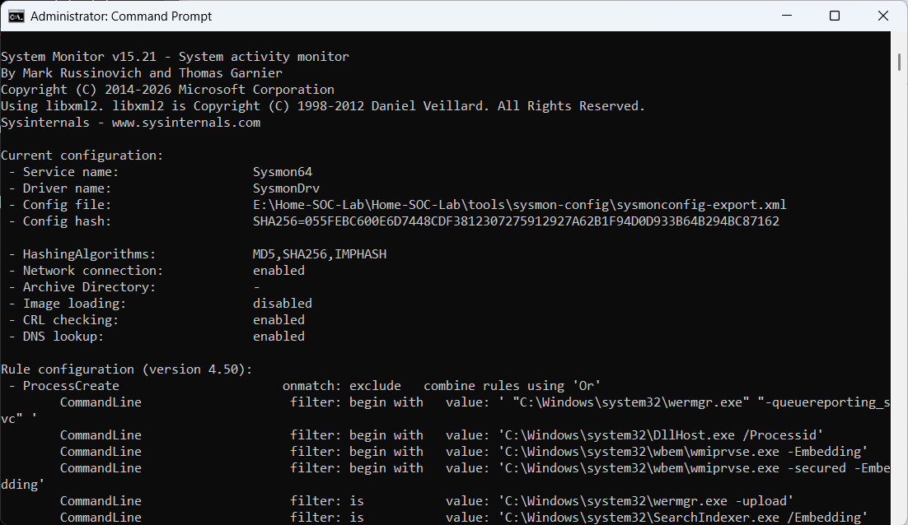

# Sysmon Installation

## Objective

Deploy Sysmon to collect detailed Windows endpoint telemetry for security monitoring.

## Configuration

- Installed Sysmon v15.x
- Applied the SwiftOnSecurity Sysmon configuration
- Enabled process, network, file, registry, and DNS monitoring

## Verification

- Verified Sysmon service is running
- Confirmed configuration was successfully loaded

## Screenshot

## Outcome

Sysmon is successfully collecting enhanced Windows endpoint events for analysis in Splunk.