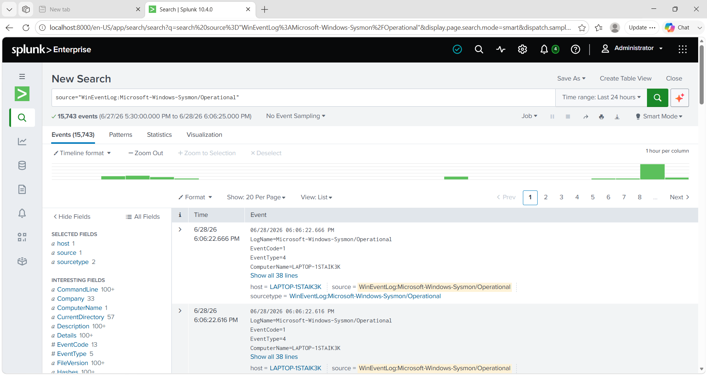

## Event Format Verification

The Windows Event Logs are displayed in the standard Splunk event format after disabling XML rendering (`renderXml=false`). This provides cleaner events and improves investigation readability.

### Screenshot

a# Windows Event Log Ingestion

## Objective

Verify that Sysmon events are successfully forwarded from the Windows endpoint to Splunk Enterprise.

## Verification

- Universal Forwarder is connected to Splunk
- Sysmon Operational log is being collected
- Events are searchable in Splunk

## SPL Query

```spl
source="WinEventLog:Microsoft-Windows-Sysmon/Operational"
```

## Screenshot



## Outcome

Splunk successfully receives and indexes Sysmon events from the Windows endpoint.